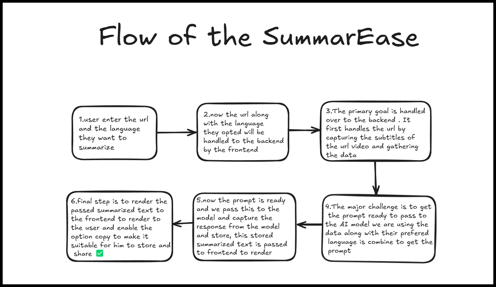

# SummarEase  


SummarEase is a web application that allows users to summarize video content from a given URL and translate the summary into their preferred language. The application efficiently extracts subtitles, processes the content using an AI model, and provides a concise summary. 
## Video URL
[Demo And Explanation](https://drive.google.com/file/d/1gCU0Ley8Z5RI969KjDsKXiNm567U7dyr/view?usp=sharing)

## Features  
1. **Accepts a URL and the preferred language for summarization.**  
2. **Extracts subtitles from videos.**  
3. **Processes the text using an AI model.**  
4. **Summarizes and translates content into the selected language.**  
5. **Provides an option to copy and store the summary.**  

## Flow of the Application  
1. **User Input**: The user enters a URL and selects a language for summarization.  
2. **Frontend Handling**: The frontend sends the URL and language preference to the backend.  
3. **Backend Processing**: The backend extracts subtitles from the video and gathers the necessary data.  
4. **Prompt Preparation**: The extracted data is combined with the preferred language to form a structured prompt.  
5. **AI Processing**: The prompt is passed to the AI model, which generates a summarized response.  
6. **Rendering Output**: The summarized text is sent to the frontend for display, with an option to copy and store the summary.  




## Installation & Setup  

### Prerequisites  
- **Node.js**  
- **npm**

### Steps  

1. Clone the repository:  
   ```sh
   git clone https://github.com/yourusername/SummarEase.git
   cd SummarEase
2. Install dependencies:
   ```sh
   npm install
3. Start the backend server:
   ```sh
   npm run server
4. Start the frontend:
   ```sh
   npm start
## Technologies Used  

- **Frontend**: React.js  
- **Backend**: Node.js, Express.js  
- **AI Model**: Gemini-API
- **Other Tools**:  Used As Per Requirement

## Deployment Links  
**TRY THEM HERE**


[Backend](https://summarease-backend-9dfy.vercel.app/)  
[Complete App](https://vercel.com/kollideepikas-projects/summarease)


## Future Enhancements  

- Support for more video platforms.  
- Improved AI model for better summarization.  
- User authentication for personalized summaries.  
- Export summaries as PDF or text files.  


## Contributors  

**Deepika Kolli**  

Contributions are welcome! Feel free to open an issue or submit a pull request.  

